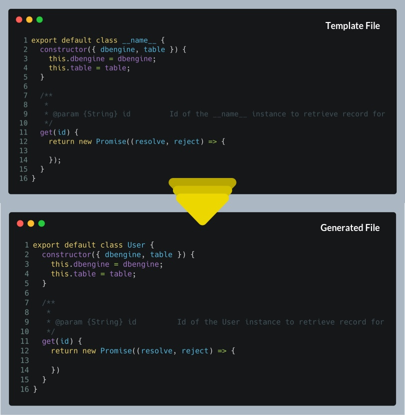

# 👸🏻 Jengen

A Simple Scaffolding CLI tool

## Whats Jengen?

Jen-*gen* is a simple scaffolding tool with minimal configuration. The goal is to provide enough flexibillity to match any workflow without having you write any extra code. Just create your templates and *Jen* will handle it.

## Usage

### Install jengen 

```console
thor@marvel avgs-lp % npm i -g jengen
```

### Create your config file

Create a `jen.config.json` file at the root level of your application. Here's an example of the config file

```jsonc
{
  // Modules are what gets generated
  "modules": {
    // Component here is the module name
    "Component": {
      // Source of the template, can be a file or a directory
      "source": ".jen/Component",
      // Destination of your module, where the file or the directory will be generated to
      "destination": "./src/Components"
    },
    // Model is a module name
    "Model": {
      // Source of the template, can be a file or a directory
      "source": ".jen/Model.js",
      // Destination of your module, where the file or the directory will be generated to
      "destination": "./src/Models",
      // filename is required if source is a file
      "filename": "__name__.js"
    }
  }
}
```

You'll notice something weird in the config file, **`__name__`.js**, this is a placeholder. Any string wrapped by **__***(double underscore)* will be treated as a placeholder and the value will be replaced by arguments passed to jen gen. More on this in the next step.

### Gen your modules

To gen your module, you need to tell jen

- which module to gen
- placeholder values

Here's an example,

```console
thor@marvel avgs-lp % jen gen --module Model --name User
```

Based on the config above, jen will generate a new **User.js** file in **./src/Models** folder. If the contents of the template file have any of the placeholders, they'll be replaced by the values passed.

If the keyword gen throws you off, you could use any one these aliases,

- generate
- make
- clone

Example:

```console
thor@marvel avgs-lp % jen clone --module Model --name User
```

You can also ditch specifying module using the args syntax and just specify your module name after `gen` command.

Example: 
```console
thor@marvel avgs-lp % jen gen Model --name User
```
or using one of the aliases

```console
thor@marvel avgs-lp % jen clone Model --name User
```


