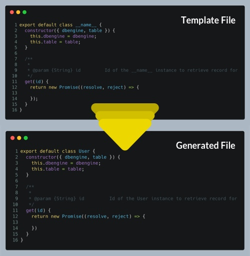

# 👸 Jengen

[](https://packagephobia.com/result?p=jengen)
[](https://www.npmjs.com/package/jengen?activeTab=dependencies)
[](https://www.npmjs.com/package/jengen)

A Simple Scaffolding CLI tool

## Whats Jengen?

Jen-*gen* is a simple scaffolding tool with minimal configuration. The goal is to provide a scaffolding solution that works for every web developer's workflow without requiring any code writing on the developer's end.

Sidenote: This is a template based solution and the templates are to be provided by the dev using Jengen. It's super duper likely that the templates will be some sort of code. You could argue that devs providing template is violating the goal but in this case templates are not code but configuration.

## Usage

### Install jengen 

```console
thor@marvel avgs-lp % npm i -g jengen
```

### Create your config file

Create a `jen.config.json` file at the root level of your application. Here's an example of the config file

```jsonc
{
  // Modules are what gets generated
  "modules": {
    // Component here is the module name
    "Component": {
      // Source of the template, can be a file or a directory
      "source": ".jen/Component",
      // Destination of your module, where the file or the directory will be generated to
      "destination": "./src/Components"
    },
    // Model is a module name
    "Model": {
      // Source of the template, can be a file or a directory
      "source": ".jen/Model.js",
      // Destination of your module, where the file or the directory will be generated to
      "destination": "./src/Models",
      // filename is required if source is a file
      "filename": "__name__.js"
    }
  }
}
```

You'll notice something weird in the config file, **`__name__`.js**, this is a placeholder. Any string wrapped by **__***(double underscore)* will be treated as a placeholder and the value will be replaced by arguments passed to jen gen. More on this in the next step.

### Gen your modules

To gen your module, you need to tell jen

- which module to gen
- placeholder values

Here's an example,

```console
thor@marvel avgs-lp % jen gen --module Model --name User
```

Based on the config above, jen will generate a new **User.js** file in **./src/Models** directory. If the contents of the template file have any of the placeholders, they'll be replaced by the values passed.

If the keyword gen throws you off, you could use any one these aliases,

- generate
- make
- clone

Example:

```console
thor@marvel avgs-lp % jen clone --module Model --name User
```

You can also ditch specifying module using the args syntax and just specify your module name after `gen` command.

Example: 
```console
thor@marvel avgs-lp % jen gen Model --name User
```
or using one of the aliases

```console
thor@marvel avgs-lp % jen clone Model --name User
```



### Example for a directory based module

In a directory based module, jen will duplicate files and the directory structure.

- Files with placeholder name will have their names replaced,
- Placeholders in file content will be replaced.

For the config below
```jsonc
{
  // Modules are what gets generated
  "modules": {
    // Component here is the module name
    "Component": {
      // Source of the template, can be a file or a directory
      "source": ".jen/Component",
      // Destination of your module, where the file or the directory will be generated to
      "destination": "./src/Components"
    },
}
```

and the following source directory structure *(.jen/Component)*

```bash
├── .jen
│   ├── Component
│   │   ├── __name__
│   │   │   ├── index.js
│   │   │   ├── __name__.js
│   │   │   ├── __name__.module.js
```

on running `jen gen Component --name Button`

will generate the following directory structure in the destination directory *(./src/Components)*

```bash
├── src
│   ├── Components
│   │   ├── Button
│   │   │   ├── index.js
│   │   │   ├── Button.js
│   │   │   ├── Button.module.js
```
  
## Why name this Jengen?

Because generator, scaffold, gen already exist on npm.

I had an idea to call this package Doraemon, the cartoon character. If you are not familiar with Doraemon, Doraemon is an alien who befriended a kid and helps the kid woo his crush and beat his bully by pulling out  revolutionary items from it's magic pouch.

I had this whole idea of cli command being `do pull Component ...` but then I fell asleep and had totally forgotten about it. I just remembered this whole thing while writing this section of the doc. 

Plus just checked, doraemon is taken.
